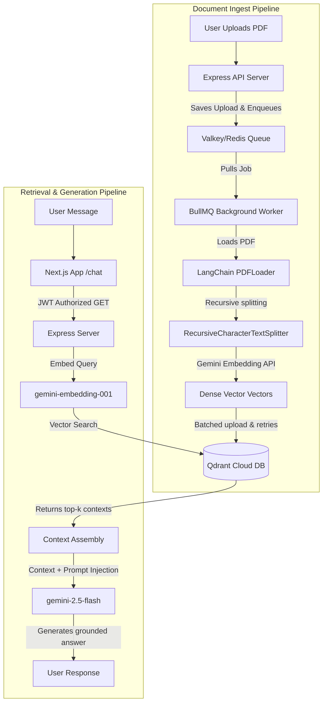

# 🤖 RAG PDF Assistant

An intelligent, secure **Retrieval-Augmented Generation (RAG)** application that allows users to upload PDF documents, index them semantically, and have contextual, hallucination-free conversations based on the uploaded content.

🚀 **Live Deployment:** [RAG PDF Assistant](https://rag-pdf-assistant-dxdpqu01z-wolf19.vercel.app/)
⚙️ **Backend API Server:** [https://rag-pdf-backend-penv.onrender.com](https://rag-pdf-backend-penv.onrender.com)

---

## 💡 The Problem Statement
Standard Large Language Models (LLMs) are highly capable, but suffer from two major limitations in real-world productivity:
1. **Knowledge Cutoffs & Lack of Context:** They do not have access to your private, specialized, or recently created documents (e.g., product manuals, legal agreements, research papers, resumes).
2. **Context Window Limits & Cost:** Feeding large documents directly into the prompt history is expensive, overflows context limits, and degrades the quality of the LLM's attention.

### 🛡️ The RAG Solution
This project solves this by implementing a **RAG (Retrieval-Augmented Generation)** architecture:
* Instead of uploading whole documents to the prompt, we parse and segment documents into smaller, semantic chunks.
* We convert these chunks into dense vector representations (embeddings) and store them in a fast vector database (**Qdrant**).
* When a user queries the bot, the system searches the database for the most relevant text passages, injects only those passages as context into the prompt, and sends it to the LLM (**Google Gemini**).
* The LLM then generates an accurate response grounded strictly in the source text.

---

## ⚙️ Architecture & Data Flow



---

## 🛠️ Tech Stack

### Frontend (Client)
* **Framework:** Next.js 16 (App Router, Turbopack) & React 19 (for high-performance rendering).
* **Styling:** TailwindCSS (modern dark/light aesthetic).
* **Authentication:** Clerk Next.js SDK (v7) for secure user sessions, signup, and sign-in gates.
* **Icons:** Lucide React.

### Backend (Server)
* **API Server:** Express.js (Node.js runtime).
* **Task Queue:** BullMQ with Valkey (Redis) for processing long-running parsing tasks asynchronously without blocking HTTP threads.
* **File Uploads:** Multer (with disk-storage verification on startup).
* **Authentication Verification:** Clerk Express middleware (`@clerk/express`) for JWT header decryption and endpoint shielding.

### AI & Vector Database
* **LLM Engine:** Google Gemini API (`gemini-2.5-flash` for fast responses).
* **Embeddings Model:** `gemini-embedding-001` (producing 768-dimensional dense vectors).
* **Vector Database:** Qdrant Cloud (fully managed, highly scalable vector search).
* **Orchestration:** LangChain JS & Google GenAI SDK.

---

## 🚀 Key Technical Challenges Solved

### 1. Unified Web Server & Queue Worker (Zero-Cost Hosting)
Free hosting services like Render charge by the active container. Running a separate Web service and a separate Background Worker would cost $7+/month. We resolved this by importing and starting the BullMQ worker **inside the same process** as the Express.js server, allowing both to run in a single container for **$0/month**.

### 2. Gemini API Free-Tier Rate-Limit Protection (15 RPM)
Gemini's free tier caps embedding requests at 15 Requests Per Minute (RPM). Bulk document uploading easily trips this, leading to empty embeddings and failed vector store uploads. 
We implemented:
* **Sequential Batching:** Text chunks are sent in batches of `50`.
* **Rate-Limit Cooling:** A `5000ms` delay is enforced between batches.
* **Auto-Retries with Backoff:** Failed network chunks are wrapped in a 4-attempt auto-retry helper with a `6000ms` cooling backoff delay.

### 3. Cross-Origin Clerk Identity Authentication
To secure the database, we disabled public `/chat` and `/upload` access. Next.js handles Clerk token generation, passing the JWT inside the `Authorization: Bearer <JWT>` header. The Express server decrypts and validates these tokens inline using `@clerk/express` to authenticate calls before processing files or querying the vector store.

### 4. Next.js 16 Responsive Layout (Viewport Lock)
Avoided browser-level layout spillages by locking the main page wrappers to `h-screen overflow-hidden` and wrapping the chat messages in a nested `flex-1 min-h-0 overflow-y-auto` structure. This keeps the chatbot inputs always visible and sticky at the bottom of the user's viewport without forcing global scrollbars.

---

## 🏃 Local Setup & Run

### Prerequisites
* **Node.js:** v20+
* **Docker & Docker Compose** (for running local Redis and Qdrant instances)

### Step 1: Clone and Install Dependencies
```bash
git clone <your-repo-url>
cd rag-pdf

# Install client dependencies
cd client && npm install

# Install server dependencies
cd ../server && npm install
```

### Step 2: Set Up Environment Variables
Create `.env` files in both directories based on the templates:

#### Client (`client/.env`)
```env
NEXT_PUBLIC_CLERK_PUBLISHABLE_KEY=your_clerk_publishable_key
CLERK_SECRET_KEY=your_clerk_secret_key
NEXT_PUBLIC_API_URL=http://localhost:8000
```

#### Server (`server/.env`)
```env
GOOGLE_API_KEY=your_gemini_google_api_key
PORT=8000
REDIS_HOST=localhost
REDIS_PORT=6379
REDIS_PASSWORD=
QDRANT_URL=http://localhost:6333
QDRANT_API_KEY=
QDRANT_COLLECTION_NAME=pdf-docs
CLERK_PUBLISHABLE_KEY=your_clerk_publishable_key
CLERK_SECRET_KEY=your_clerk_secret_key
```

### Step 3: Spin Up Local Services (Redis & Qdrant)
Ensure Docker is running, then run:
```bash
docker compose up -d
```

### Step 4: Run the Application
In separate terminal windows, run the following:

#### Start Frontend Client
```bash
cd client
npm run dev
```

#### Start Backend Server
```bash
cd server
npm run start
```

---

## ☁️ Cloud Deployment Configuration

### 💻 Frontend (Vercel)
* **Framework Preset:** `Next.js`
* **Root Directory:** `client`
* **Environment Variables:** Define `NEXT_PUBLIC_CLERK_PUBLISHABLE_KEY`, `CLERK_SECRET_KEY`, and `NEXT_PUBLIC_API_URL` pointing to your Render backend domain.

### 🔌 Backend (Render)
* **Service Type:** Web Service
* **Build Command:** `npm install` (inside the `server` directory)
* **Start Command:** `node index.js`
* **Environment Variables:** Load variables listed in the server configuration, ensuring `REDIS_PASSWORD` and TLS settings are populated (e.g., using Upstash Redis).
